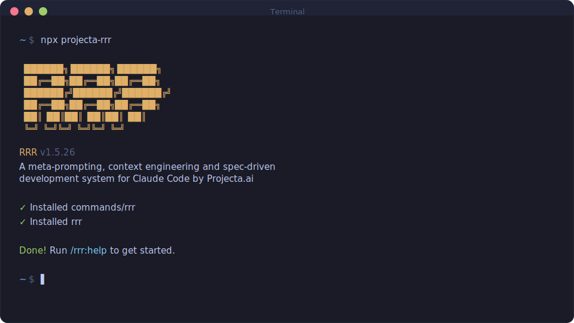

<div align="center">

# RRR

**A light-weight and powerful meta-prompting, context engineering and spec-driven development system for Claude Code by Projecta.ai**

**Solves context rot — the quality degradation that happens as Claude fills its context window.**

[](https://www.npmjs.com/package/projecta-rrr)
[](https://www.npmjs.com/package/projecta-rrr)
[](LICENSE)
[](https://github.com/PA-Ai-Team/projecta-rrr)

<br>

```bash
npx projecta-rrr
```

**Works on Mac, Windows, and Linux.**

<br>



<br>

*"If you know clearly what you want, this WILL build it for you. No bs."*

*"I've done SpecKit, OpenSpec and Taskmaster — this has produced the best results for me."*

*"By far the most powerful addition to my Claude Code. Nothing over-engineered. Literally just gets shit done."*

<br>

**Trusted by engineers at Amazon, Google, Shopify, and Webflow.**

[Why I Built This](#why-i-built-this) · [How It Works](#how-it-works) · [Commands](#commands) · [Why It Works](#why-it-works)

</div>

---

## Why I Built This

I'm a solo developer. I don't write code — Claude Code does.

Other spec-driven development tools exist; BMAD, Speckit... But they all seem to make things way more complicated than they need to be (sprint ceremonies, story points, stakeholder syncs, retrospectives, Jira workflows) or lack real big picture understanding of what you're building. I'm not a 50-person software company. I don't want to play enterprise theater. I'm just a creative person trying to build great things that work.

So I built RRR. The complexity is in the system, not in your workflow. Behind the scenes: context engineering, XML prompt formatting, subagent orchestration, state management. What you see: a few commands that just work.

The system gives Claude everything it needs to do the work *and* verify it. I trust the workflow. It just does a good job.

That's what this is. No enterprise roleplay bullshit. Just an incredibly effective system for building cool stuff consistently using Claude Code.

— **Projecta.ai**

---

Vibecoding has a bad reputation. You describe what you want, AI generates code, and you get inconsistent garbage that falls apart at scale.

RRR fixes that. It's the context engineering layer that makes Claude Code reliable. Describe your idea, let the system extract everything it needs to know, and let Claude Code get to work.

---

## Who This Is For

People who want to describe what they want and have it built correctly — without pretending they're running a 50-person engineering org.

---

## Getting Started

```bash
npx projecta-rrr
```

That's it. Verify with `/rrr:help` inside your Claude Code interface.

> **Installed from inside Claude Code?** Slash commands won't load until you restart:
> 1. Type `exit` to quit Claude Code
> 2. Run `claude` again
> 3. Then run `/rrr:help`
>
> This resolves "Unknown skill: rrr:help" errors.

### Where to Run Commands

| Environment | What to run | Notes |
|-------------|-------------|-------|
| **Inside Claude Code** | `/rrr:*` slash commands | Interactive planning/execution |
| **Outside Claude Code** | `bash scripts/pushpa-mode.sh` | Unattended overnight runs |
| **npm scripts** | `npm run pushpa`, `npm run e2e` | Convenience wrappers |

**After installing from inside Claude Code:** Exit and restart `claude` to load new commands.

**Pushpa Mode (overnight):** Always run in a separate terminal window for true unattended execution. The script detects if running inside Claude Code and prompts you to confirm or exit.

### Quick Start by Scenario

| Your situation | Command to run |
|----------------|----------------|
| **Empty folder** (greenfield) | `/rrr:new-project` — bootstraps Next.js/TS + full planning |
| **Existing repo** (brownfield) | `/rrr:map-codebase` (optional) → `/rrr:new-project` |
| **Already initialized** (has `.planning/STATE.md`) | `/rrr:progress` |
| **Not sure which?** | `/rrr:mvp` — detects state and routes you |

**MVP Definition of Done at Projecta:** local demo runs + tests pass.

### Pushpa Mode (Overnight Autopilot)

Run phases unattended while you sleep. **Best run in a normal terminal** (outside Claude Code):

```bash
bash scripts/pushpa-mode.sh
# or
npm run pushpa
```

> **Where to run:** A system terminal or VS Code integrated terminal works great. Running inside the Claude interactive session can trigger approval prompts. The script detects this and prompts you to confirm or exit.

**Quick guidance:** `/rrr:overnight` — checks prerequisites and gives exact instructions.

**Outputs:**
- Report: `.planning/PUSHPA_REPORT.md`
- Logs: `.planning/logs/pushpa_*.log`
- Artifacts: `.planning/artifacts/playwright/`

**Optional:** Add to your project's `package.json`:
```json
{
  "scripts": {
    "pushpa": "bash scripts/pushpa-mode.sh"
  }
}
```

### Staying Updated

RRR evolves fast. Check for updates periodically:

```
/rrr:whats-new
```

Update with:

```bash
npx projecta-rrr@latest
```

<details>
<summary><strong>Non-interactive Install (Docker, CI, Scripts)</strong></summary>

```bash
npx projecta-rrr --global   # Install to ~/.claude/
npx projecta-rrr --local    # Install to ./.claude/
```

Use `--global` (`-g`) or `--local` (`-l`) to skip the interactive prompt.

</details>

<details>
<summary><strong>Development Installation</strong></summary>

Clone the repository and run the installer locally:

```bash
git clone https://github.com/PA-Ai-Team/projecta-rrr.git
cd projecta-rrr
node bin/install.js --local
```

Installs to `./.claude/` for testing modifications before contributing.

</details>

### Recommended: Skip Permissions Mode

RRR is designed for frictionless automation. Run Claude Code with:

```bash
claude --dangerously-skip-permissions
```

> [!TIP]
> This is how RRR is intended to be used — stopping to approve `date` and `git commit` 50 times defeats the purpose.

<details>
<summary><strong>Alternative: Granular Permissions</strong></summary>

If you prefer not to use that flag, add this to your project's `.claude/settings.json`:

```json
{
  "permissions": {
    "allow": [
      "Bash(date:*)",
      "Bash(echo:*)",
      "Bash(cat:*)",
      "Bash(ls:*)",
      "Bash(mkdir:*)",
      "Bash(wc:*)",
      "Bash(head:*)",
      "Bash(tail:*)",
      "Bash(sort:*)",
      "Bash(grep:*)",
      "Bash(tr:*)",
      "Bash(git add:*)",
      "Bash(git commit:*)",
      "Bash(git status:*)",
      "Bash(git log:*)",
      "Bash(git diff:*)",
      "Bash(git tag:*)"
    ]
  }
}
```

</details>

---

## Projecta Preferred Pack

RRR includes a default stack optimized for rapid MVP development. Defaults are recommended but overrideable.

### Where Defaults Live

| File | Purpose |
|------|---------|
| `projecta.defaults.json` | Global defaults (core stack, preferred providers, discouraged list) |
| `.planning/MVP_FEATURES.yml` | Per-project capability selections |
| `.planning/PROJECT.md` | Deviation Notes (any overrides from defaults) |

### Core Stack (always assumed)

- **Framework:** Next.js (App Router) + TypeScript
- **Package Manager:** npm
- **UI:** Tailwind CSS + shadcn/ui
- **Testing:** Vitest (unit) + Playwright (e2e)

### Preferred Providers

| Capability | Default | Alternative |
|------------|---------|-------------|
| Database | Neon | — |
| Auth | Clerk | Neon Auth |
| Payments | Stripe | — |
| Object Storage | Cloudflare R2 (S3-compatible) | — |
| Analytics | PostHog | — |
| Voice | Deepgram | — |
| Deploy | Render | — |

### Agent Stack (when agents needed)

- **Orchestration:** Mastra
- **Agent Auth:** Auth.dev
- **Agent Mail:** Agentmail
- **Sandbox:** E2B
- **Browser Automation:** Browserbase

### Overrides

If you choose a non-default provider, RRR asks for a reason and records it in Deviation Notes:

```markdown
## Deviation Notes

| Capability | Default | Chosen | Reason |
|------------|---------|--------|--------|
| auth | clerk | auth0 | Client requires Auth0 for SSO compliance |
```

### Discouraged Providers

These are allowed but require explicit justification: Firebase, Supabase, Auth0, Vercel, PlanetScale.

### MCP Auto-Setup

RRR includes an MCP registry that maps your selected providers to their MCP servers. After `/rrr:new-project` generates your `MVP_FEATURES.yml`:

```bash
npm run mcp:setup
```

This reads your feature selections and outputs the MCP configuration for Claude Code. Only MCPs you actually need get installed.

| Feature | MCP Server |
|---------|------------|
| Database (Neon) | `@neondatabase/mcp-server-neon` |
| Payments (Stripe) | `@stripe/mcp` |
| Analytics (PostHog) | `@anthropic/mcp-posthog` |
| Voice (Deepgram) | `@deepgram/mcp-server` |
| Browser (Browserbase) | `@anthropic/mcp-browserbase` |
| Sandbox (E2B) | `@e2b/mcp-server` |
| Storage (Cloudflare R2) | `@cloudflare/mcp-server-r2` |

**Always included:** Context7 (docs), GitHub, Filesystem, Sequential Thinking.

### Pushpa Mode (Autopilot)

Run phases overnight while you sleep. Pushpa Mode is an unattended runner that plans and executes phases sequentially, with token-safe budgets and persistent state.

**After running `npx projecta-rrr`, Pushpa Mode is automatically installed:**
- `scripts/pushpa-mode.sh` — the runner script
- `npm run pushpa` — npm script shortcut

```bash
bash scripts/pushpa-mode.sh
# or
npm run pushpa
```

**What it does:**
1. Preflights required API keys based on your `MVP_FEATURES.yml`
2. Iterates through phases in order
3. Plans any phase that doesn't have a plan yet
4. Executes phases automatically
5. **Skips** phases marked with `HITL_REQUIRED: true` (human verification needed)
6. Runs visual proof (Playwright tests) after each phase
7. Generates a morning report at `.planning/PUSHPA_REPORT.md`

**Token-Safe Budgets:**

Pushpa Mode enforces hard limits to prevent runaway token consumption. Override via environment variables:

| Budget | Default | Env Var |
|--------|---------|---------|
| Max phases per run | 3 | `MAX_PHASES_PER_RUN` |
| Max total minutes | 180 | `MAX_TOTAL_MINUTES` |
| Max RRR calls | 25 | `MAX_TOTAL_RRR_CALLS` |
| Max plan attempts per phase | 2 | `MAX_PLAN_ATTEMPTS_PER_PHASE` |
| Max exec attempts per phase | 2 | `MAX_EXEC_ATTEMPTS_PER_PHASE` |
| Max consecutive failures | 3 | `MAX_CONSECUTIVE_FAILURES` |
| Max same failure repeats | 2 | `MAX_SAME_FAILURE_REPEAT` |
| Backoff between retries | 10s | `BACKOFF_SECONDS` |

**Persistent Ledger:**

State survives crashes and restarts. The ledger at `.planning/pushpa/ledger.json` tracks:
- Phases started/completed
- Call counts and timing
- Failure history with signatures
- Resume point for interrupted runs

**Stop Conditions:**

Pushpa Mode automatically stops when:
- Budget exceeded (phases, time, or calls)
- Same failure repeats (prevents infinite retry loops)
- Git conflicts detected
- Required env vars missing

**Prerequisites:**
- Run `/rrr:new-project` first (project must be initialized)
- Set all required API keys (script will check and warn)
- Recommend enabling YOLO mode in `.planning/config.json`

**MVP_FEATURES.yml location:**
- Preferred: `./MVP_FEATURES.yml` (repo root)
- Legacy: `./.planning/MVP_FEATURES.yml`

**Where outputs live:**
- Report: `.planning/PUSHPA_REPORT.md`
- Logs: `.planning/logs/pushpa_*.log`
- Ledger: `.planning/pushpa/ledger.json`

**HITL Convention:**
Plans that require human verification should include one of these markers:
- `HITL_REQUIRED: true` (canonical)
- `HUMAN_VERIFICATION_REQUIRED`
- `MANUAL_VERIFICATION`

Pushpa Mode will skip these phases and record them in the report for manual follow-up.

**Where to run Pushpa Mode:**
- **Recommended:** Run in a normal system terminal (outside Claude Code) for true unattended overnight runs:
  ```bash
  bash scripts/pushpa-mode.sh
  ```
- Running inside Claude Code works but can trigger approval prompts ("Do you want to proceed?").
- The script detects if it's running inside Claude Code and prompts: `Continue running Pushpa Mode inside Claude Code? (y/N)` — default is **No**. Press Enter to exit with instructions to run externally.

### Visual Proof (Automated UX Verification)

RRR includes automated visual proof via Playwright tests and UX telemetry capture.

**What it captures:**
- Playwright test results (pass/fail)
- Console errors and warnings
- Page errors (uncaught exceptions)
- Network failures (4xx, 5xx, failed requests)
- Screenshots, traces, and videos (on failure)

**Artifacts location:**
```
.planning/
├── VISUAL_PROOF.md                    # Append-only run log
└── artifacts/
    └── playwright/
        ├── report/                    # HTML report (index.html)
        │   └── index.html
        └── test-results/              # Per-test artifacts
            ├── screenshot.png         # Captured on failure
            ├── trace.zip              # Recorded trace
            └── video.webm             # Recorded video
```

**Modes** (configured in `.planning/config.json`):

| Mode | Behavior |
|------|----------|
| `playwright` | Headless Playwright tests (default) |
| `playwright_headed` | Headed if TTY available |
| `hybrid` | Headless first, prompt for interactive fallback on eligible failures |
| `interactive_only` | Skip Playwright, show manual UAT checklist |

**Commands:**
```bash
npm run e2e              # Run Playwright tests (headless)
npm run e2e:headed       # Run with browser visible
npm run e2e:ui           # Playwright UI mode (interactive)
npm run visual:open      # Open last HTML report
bash scripts/visual-proof.sh  # Full visual proof runner
```

**Interactive verification (optional):**
```bash
npx playwright test --ui     # Playwright UI mode for exploratory testing
npx playwright test --headed # See tests execute in browser
claude --chrome              # Deep UX exploration with Claude
```

**Integration:**
- Runs automatically after `/rrr:execute-phase` (if e2e tests exist)
- Runs automatically after `/rrr:execute-plan` (if tests exist)
- Runs in Pushpa Mode (headless only, never interactive)
- Results logged to `.planning/VISUAL_PROOF.md` (append-only)

**VISUAL_PROOF.md format:**
Each run appends an entry with datetime, plan/phase ID, commands run, pass/fail status, console errors, and artifact paths.

**UX Telemetry Fixture:**

Bootstrap includes a telemetry fixture at `e2e/fixtures/ux-telemetry.ts`. Import it in your tests to capture browser events automatically:

```typescript
import { test } from '../fixtures/ux-telemetry';

test('my test', async ({ page }) => {
  // Console errors, page errors, and network failures
  // are automatically captured during this test
});
```

---

## How It Works

### 1. Initialize Project (~10 minutes)

```
/rrr:new-project
```

One command, one flow. The system:

1. **Questions** — Asks until it understands your idea completely (goals, constraints, tech preferences, edge cases)
2. **Research** — Spawns parallel agents to investigate the domain (optional but recommended)
3. **Requirements** — Extracts what's v1, v2, and out of scope
4. **Roadmap** — Creates phases mapped to requirements

You approve the roadmap. Now you're ready to build.

**Creates:** `PROJECT.md`, `REQUIREMENTS.md`, `ROADMAP.md`, `STATE.md`, `.planning/research/`

### 2. Plan Phase

```
/rrr:discuss-phase 1   # Optional: clarify UI/UX/behavior decisions first
/rrr:plan-phase 1
```

**discuss-phase** (optional) — If the phase has gray areas (UI choices, UX flows, behavior decisions), discuss them first. Creates `CONTEXT.md` that guides planning. Skip if you trust the system's defaults.

**plan-phase** — The system:

1. **Researches** — Investigates how to implement this specific phase
2. **Plans** — Creates 2-3 atomic task plans with XML structure
3. **Verifies** — Checks plans against requirements, loops if needed

Ready when plans pass verification.

### 3. Execute Phase

```
/rrr:execute-phase 1
```

The system:

1. **Runs plans in waves** — Parallel where possible, sequential when dependent
2. **Fresh context per plan** — 200k tokens purely for implementation, zero degradation
3. **Verifies code** — Checks against phase goals when complete

### 4. Repeat

```
/rrr:plan-phase 2
/rrr:execute-phase 2
...
/rrr:complete-milestone   # When all phases done
```

Loop plan → execute until milestone complete. Ship your MVP. Start next milestone.

---

## Existing Projects (Brownfield)

Already have code? Start here instead.

### 1. Map the codebase

```
/rrr:map-codebase
```

Spawns parallel agents to analyze your code. Creates `.planning/codebase/` with structured analysis of your stack, architecture, conventions, and concerns.

### 2. Initialize and build

```
/rrr:new-project
```

Same flow as greenfield, but the system knows your codebase. Questions focus on what you're adding/changing. Then plan → execute as normal.

The codebase docs load automatically during planning. Claude knows your patterns, conventions, and where to put things.

---

## Why It Works

### Context Engineering

Claude Code is incredibly powerful *if* you give it the context it needs. Most people don't.

RRR handles it for you:

| File | What it does |
|------|--------------|
| `PROJECT.md` | Project vision, always loaded |
| `research/` | Ecosystem knowledge (stack, features, architecture, pitfalls) |
| `REQUIREMENTS.md` | Scoped v1/v2 requirements with phase traceability |
| `ROADMAP.md` | Where you're going, what's done |
| `STATE.md` | Decisions, blockers, position — memory across sessions |
| `PLAN.md` | Atomic task with XML structure, verification steps |
| `SUMMARY.md` | What happened, what changed, committed to history |
| `todos/` | Captured ideas and tasks for later work |

Size limits based on where Claude's quality degrades. Stay under, get consistent excellence.

### XML Prompt Formatting

Every plan is structured XML optimized for Claude:

```xml
<task type="auto">
  <name>Create login endpoint</name>
  <files>src/app/api/auth/login/route.ts</files>
  <action>
    Use jose for JWT (not jsonwebtoken - CommonJS issues).
    Validate credentials against users table.
    Return httpOnly cookie on success.
  </action>
  <verify>curl -X POST localhost:3000/api/auth/login returns 200 + Set-Cookie</verify>
  <done>Valid credentials return cookie, invalid return 401</done>
</task>
```

Precise instructions. No guessing. Verification built in.

### Subagent Execution

As Claude fills its context window, quality degrades. You've seen it: *"Due to context limits, I'll be more concise now."* That "concision" is code for cutting corners.

RRR prevents this. Each plan is maximum 3 tasks. Each plan runs in a fresh subagent — 200k tokens purely for implementation, zero accumulated garbage.

| Task | Context | Quality |
|------|---------|---------|
| Task 1 | Fresh | Full |
| Task 2 | Fresh | Full |
| Task 3 | Fresh | Full |

No degradation. Walk away, come back to completed work.

### Atomic Git Commits

Each task gets its own commit immediately after completion:

```bash
abc123f docs(08-02): complete user registration plan
def456g feat(08-02): add email confirmation flow
hij789k feat(08-02): implement password hashing
lmn012o feat(08-02): create registration endpoint
```

> [!NOTE]
> **Benefits:** Git bisect finds exact failing task. Each task independently revertable. Clear history for Claude in future sessions. Better observability in AI-automated workflow.

Every commit is surgical, traceable, and meaningful.

### Modular by Design

- Add phases to current milestone
- Insert urgent work between phases
- Complete milestones and start fresh
- Adjust plans without rebuilding everything

You're never locked in. The system adapts.

---

## Commands

### Core Workflow

| Command | What it does |
|---------|--------------|
| `/rrr:new-project` | Full initialization: questions → research → requirements → roadmap |
| `/rrr:plan-phase [N]` | Research + plan + verify for a phase |
| `/rrr:execute-phase <N>` | Execute all plans in parallel waves, verify when complete |
| `/rrr:complete-milestone` | Ship it, prep next version |

### Navigation

| Command | What it does |
|---------|--------------|
| `/rrr:progress` | Where am I? What's next? |
| `/rrr:help` | Show all commands and usage guide |
| `/rrr:mvp` | Smart router: detects state, tells you exactly what to run |
| `/rrr:overnight` | Pushpa Mode guidance: preflight checks + run instructions |

### Verification

| Command | What it does |
|---------|--------------|
| `/rrr:verify-work [N]` | Manual user acceptance testing |

### Brownfield

| Command | What it does |
|---------|--------------|
| `/rrr:map-codebase` | Analyze existing codebase before new-project |

### Phase Management

| Command | What it does |
|---------|--------------|
| `/rrr:add-phase` | Append phase to roadmap |
| `/rrr:insert-phase [N]` | Insert urgent work between phases |
| `/rrr:remove-phase [N]` | Remove future phase, renumber |
| `/rrr:discuss-phase [N]` | Gather context before planning |

### Milestones

| Command | What it does |
|---------|--------------|
| `/rrr:new-milestone [name]` | Start next milestone |
| `/rrr:discuss-milestone` | Gather context for next milestone |

### Session

| Command | What it does |
|---------|--------------|
| `/rrr:pause-work` | Create handoff when stopping mid-phase |
| `/rrr:resume-work` | Restore from last session |

### Utilities

| Command | What it does |
|---------|--------------|
| `/rrr:add-todo [desc]` | Capture idea for later |
| `/rrr:check-todos` | List pending todos |
| `/rrr:debug [desc]` | Systematic debugging with persistent state |

### Skills

| Command | What it does |
|---------|--------------|
| `/rrr:list-skills` | Show all available skills (vendored + community) |
| `/rrr:install-skill [url]` | Install a skill from GitHub or skillsmp.com |
| `/rrr:search-skills [query]` | Search for skills on skillsmp.com |

---

## Skills System

Skills are context packages that load into Claude during plan execution. They enforce coding conventions, tool choices, and best practices.

### How Skills Work

1. **Planning** — Planner infers which skills are needed based on phase content
2. **Execution** — Skills load into executor context (fresh per plan)
3. **Enforcement** — Claude follows skill rules during implementation

Skills are loaded dynamically per plan. No skill accumulation across plans — keeps context clean.

### Vendored Skills

Ships with RRR:

**Projecta Skills (default stack):**
- `projecta.nextjs-typescript` ⭐ — Next.js App Router + TypeScript conventions (loads automatically)
- `projecta.testing` — Vitest + Playwright (NEVER Jest/Cypress)
- `projecta.visual-proof` — Visual proof artifact capture
- `projecta.shadcn-ui` — shadcn/ui components (NEVER Material UI/Chakra)
- `projecta.cloudflare-r2` — Cloudflare R2 storage conventions
- `projecta.mcp-stack` — MCP server integrations

**Anthropic Skills (vendored from upstream):**
- `anthropic.pdf` — PDF document handling
- `anthropic.xlsx` — Excel spreadsheet handling
- `anthropic.webapp-testing` — Web application testing
- And 13 more...

### Using Skills in Plans

Skills are auto-inferred from plan content, but you can declare them explicitly:

```yaml
---
phase: 04-auth
plan: 01
skills:
  - projecta.testing
  - projecta.visual-proof
  - anthropic.webapp-testing
---
```

**Default skill:** `projecta.nextjs-typescript` loads automatically for ALL plans. Add `skills_mode: minimal` to skip it (rare, for non-standard stacks).

**Limits:** Max 10 skills per plan, max 1000 total lines.

### Community Skills

Install skills from GitHub or skillsmp.com:

```
/rrr:install-skill https://github.com/user/repo/blob/main/SKILL.md
/rrr:search-skills react patterns
```

Community skills install to `.claude/skills/community/`.

---

## Troubleshooting

**Commands not found after install/update?**
- Restart Claude Code: type `exit`, then run `claude` again
- Verify files exist in `~/.claude/commands/rrr/` (global) or `./.claude/commands/rrr/` (local)
- Still seeing "Unknown skill"? Reinstall with `npx projecta-rrr@latest`, then restart `claude`

**Commands not working as expected?**
- Run `/rrr:help` to verify installation
- Re-run `npx projecta-rrr` to reinstall

**Updating to the latest version?**
```bash
npx projecta-rrr@latest
```

**Using Docker or containerized environments?**

If file reads fail with tilde paths (`~/.claude/...`), set `CLAUDE_CONFIG_DIR` before installing:
```bash
CLAUDE_CONFIG_DIR=/home/youruser/.claude npx projecta-rrr --global
```
This ensures absolute paths are used instead of `~` which may not expand correctly in containers.

---

## Star History

<a href="https://star-history.com/#PA-Ai-Team/projecta-rrr&Date">
 <picture>
   <source media="(prefers-color-scheme: dark)" srcset="https://api.star-history.com/svg?repos=PA-Ai-Team/projecta-rrr&type=Date&theme=dark" />
   <source media="(prefers-color-scheme: light)" srcset="https://api.star-history.com/svg?repos=PA-Ai-Team/projecta-rrr&type=Date" />
   
 </picture>
</a>

---

## License

MIT License. See [LICENSE](LICENSE) for details.

---

<div align="center">

**Claude Code is powerful. RRR makes it reliable.**

**Built by [Projecta.ai](https://projecta.ai)**

</div>
